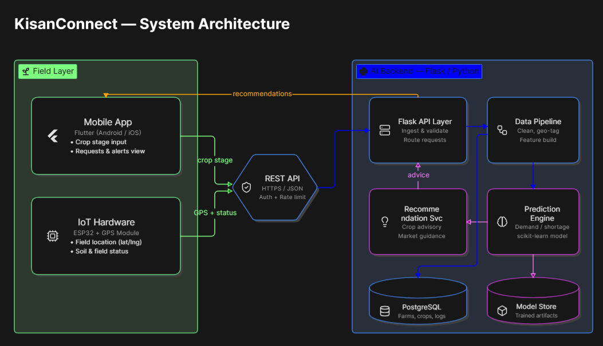

# KisanConnect 🌾
> *"The farm network that thinks ahead."*

KisanConnect is an AI + IoT-powered platform designed to predict and mitigate farm labor and machinery shortages before they happen, making agricultural rentals secure, organized, and collaborative.

---

## 🚀 Key Features

* **Predictive Shortage Forecasting:** Uses farmer-entered crop stages combined with real-time weather data via AI to anticipate labor and equipment shortages.
* **Trust Scores & Escrow Payments:** Replaces unorganized, risky rentals with a reliability rating system and secure escrow transactions.
* **Collaboration Mode:** Empowers neighboring farmers to share machine bookings, split expenses, and optimize utility.

---

## 📂 Repository Structure

* `ai_backend/` — Python-based backend handling AI shortage prediction models (`main.py`).
* `iot_firmware/` — Code for hardware integration, including ESP32 GPS tracking (`esp32_gps.ino`).
* `mobile_app/` — Cross-platform mobile application built with Flutter/Dart (`main.dart`).

---

## 🛠️ Tech Stack

* **AI / Backend:** Python, Machine Learning models for forecasting
* **IoT:** ESP32, GPS modules
* **Mobile App:** Flutter / Dart
* **Security & Trust:** Escrow logic & custom Trust Scoring system

---

## System Architecture

## ⚙️ Getting Started

### 1. AI Backend
\`\`\`bash
cd ai_backend
pip install -r requirements.txt
python main.py
\`\`\`

### 2. Mobile App
\`\`\`bash
cd mobile_app
flutter pub get
flutter run
\`\`\`
